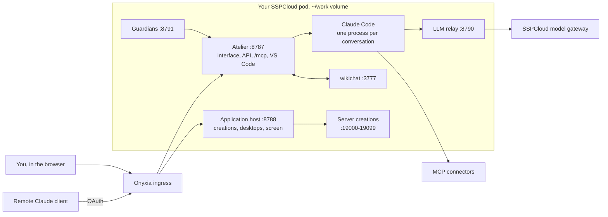

# Atelier

[](https://github.com/nic01asFr/atelier-sspcloud/actions/workflows/image.yml)
[](https://github.com/nic01asFr/atelier-sspcloud/actions/workflows/release.yml)
[](https://github.com/nic01asFr/atelier-sspcloud/actions/workflows/docs.yml)
[](https://nic01asfr.github.io/atelier-sspcloud/index.yaml)
[](LICENSE)

[Français](README.md) · **English** · [Showcase](https://nic01asfr.github.io/atelier-sspcloud/en/)

Atelier puts Claude Code to work on your SSPCloud pod, with an interface to
follow it: conversations filed by project, an Assistant that knows the
Atelier, scheduled agents and guardians that keep watch. What an agent builds
opens next to the thread, and nothing binding happens without your approval.

It is meant for people with an [SSPCloud](https://datalab.sspcloud.fr)
account who want to hand real work to an agent (data, maps, small
applications, monitoring) without losing sight of it. One pod per person,
their own model key, their data on their own volume.

The interface, the code comments and the detailed documentation are in
French; this page and the [showcase](https://nic01asfr.github.io/atelier-sspcloud/en/)
are the English entry points.

<picture>
  <source media="(prefers-color-scheme: dark)" srcset="site/assets/captures/code-creation-sombre.webp">
  
</picture>

<sub>Local instance, made-up demo data. More screenshots, in both themes, on the [showcase](https://nic01asfr.github.io/atelier-sspcloud/en/).</sub>

---

## What you do with it

Seven views: **Code**, **Assistant**, **Connecteurs** (connectors),
**Agents**, **À valider** (to approve), **Journal** (log), **Ma mémoire**
(my memory). Each feature (what it is for, how to use it, what it does not
do, where the code is, its status) is described in the reference guide,
[`docs/fonctionnalites.md`](docs/fonctionnalites.md) (in French).

| Building block | In short | Status |
|---|---|---|
| Projects and conversations | a project is a git repository; the same conversation opens in the interface, in VS Code and in the terminal, with the same tools and mode | in service |
| Creations and side panel | what an agent builds (a page or a small application) is served behind your login, on a separate origin, and opens next to the thread | in service |
| The agent's browser | one Chrome per conversation, which you watch live and can “take over” | integrated |
| Assistant | the front door: it reads the map of the Atelier, acts through commands, hands work to code agents | integrated |
| Commands, “to approve”, log | a catalogue of commands with classes (read, reversible, binding, reserved); one queue for what awaits your approval; one log of who did what | in service |
| Scheduled agents and guardians | agents born disabled, with a budget; checks written in code, with no model, and repairs proposed on a branch | in service |
| MCP connectors | one registry, chosen project by project, secrets by reference; compositions; the Atelier itself as a connector for a remote client | in service |
| wikichat and memory | coordination between agents, a map of the projects; conversation records found by meaning, “my memory” under your control | in service, integrated |
| Onyxia and GPU | a project declares its pod or service; its agents only receive the matching tools | integrated |
| Voice | a project on the pod serves STT and TTS; not in the interface yet | not yet |

*In service*: deployed and checked for real on a pod. *Integrated*: in the
code and tested, with points still to check for real.

## Install

You need an SSPCloud account and, in Onyxia, *My account › AI assistant*, a
key for `https://llm.lab.sspcloud.fr`. The full recipe, the fallback path and
the settings are in [`docs/installer.md`](docs/installer.md).

**From the Onyxia catalogue** (the usual path): add the chart repository
`https://nic01asfr.github.io/atelier-sspcloud` once, launch “Atelier”; the
form fills itself from your profile. Then open
`https://user-<idep>-atelier.user.lab.sspcloud.fr` with the owner key given in
the service notes.

**From a terminal** in an Onyxia service started with Kubernetes access
(`edit` role):

```bash
curl -fsSL https://nic01asfr.github.io/atelier-sspcloud/install.sh | bash
```

**With Helm**:

```bash
helm repo add atelier https://nic01asfr.github.io/atelier-sspcloud
helm upgrade --install atelier atelier/atelier \
  --set ingress.hostname=user-<idep>-atelier.user.lab.sspcloud.fr \
  --set-string llm.apiKey=<key from llm.lab.sspcloud.fr>
```

## Architecture



The Atelier holds the operational state (conversations, connectors,
creations, commands, log); wikichat holds knowledge and coordination. Only
the Atelier and the application host are exposed; everything else listens on
the loopback. The repository layout is described in the
[French README](README.md#architecture).

## Status and limits

Waves 1 to 3 of the vision are integrated; most of it is deployed and checked
on a real pod, the rest is covered by the test suite and on trial. The
project is young: view names and screens may still change. See
[`CHANGELOG.md`](CHANGELOG.md).

- **One pod, one person.** There is a single owner identity, and it opens
  everything. Nothing in the code supports a multi-user installation today.
  See [`SECURITY.md`](SECURITY.md).
- **The owner key is readable by agents on the pod**: profiles filter their
  tools, but an agent that omits its conversation header keeps full access to
  `/mcp`. Short-lived per-conversation capabilities will close this.
- **Not yet**: sharing a creation with other people, a publishable home-made
  connector, voice in the interface, a button to publish a project on GitHub
  (the API exists), cost per actor.

## Claude Code

This repository **does not contain** Claude Code. On first start, the chart's
image installs the Claude Code extension (which brings the CLI) from the
code-server marketplace, then keeps it on the persistent volume; its use
remains subject to Anthropic's terms.
Inference goes through the model gateway set by `ANTHROPIC_BASE_URL` (the
SSPCloud one by default), with your key, not through a shared account.
Independent project, not affiliated with Anthropic.

## Contributing

Tests, conventions and how to propose a change:
[`CONTRIBUTING.md`](CONTRIBUTING.md) (in French). Report vulnerabilities
privately ([`SECURITY.md`](SECURITY.md)). The project follows a
[code of conduct](CODE_OF_CONDUCT.md).

## Licence

Apache-2.0, see [`LICENSE`](LICENSE). It covers the code in this repository,
not Claude Code nor the third-party software the image installs.
