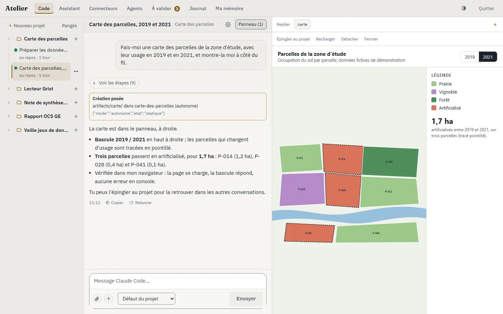
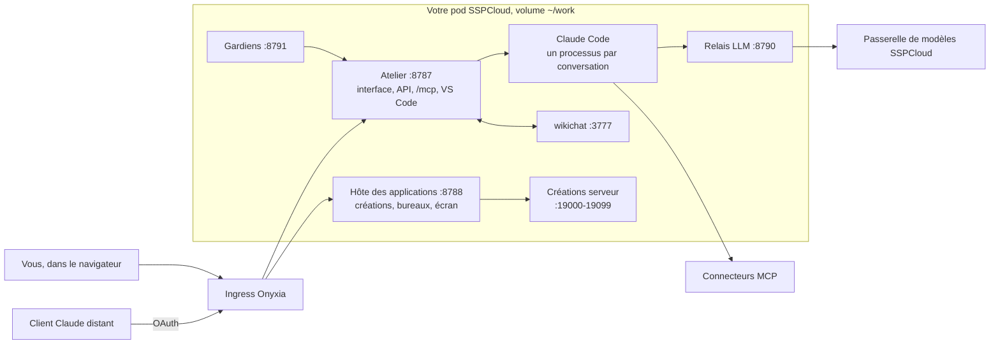

# Atelier

[](https://github.com/nic01asFr/atelier-sspcloud/actions/workflows/image.yml)
[](https://github.com/nic01asFr/atelier-sspcloud/actions/workflows/release.yml)
[](https://github.com/nic01asFr/atelier-sspcloud/actions/workflows/docs.yml)
[](https://nic01asfr.github.io/atelier-sspcloud/index.yaml)
[](LICENSE)

**Français** · [English](README.en.md) · [Vitrine](https://nic01asfr.github.io/atelier-sspcloud/)

L'Atelier fait travailler Claude Code sur votre pod SSPCloud, avec une
interface pour le suivre : des conversations rangées par projet, un Assistant
qui connaît l'Atelier, des agents planifiés et des gardiens qui surveillent.
Ce qu'un agent fabrique s'ouvre à côté du fil, et rien d'engageant ne se fait
sans votre accord.

Il s'adresse aux personnes qui ont un compte [SSPCloud](https://datalab.sspcloud.fr)
et veulent confier du vrai travail à un agent (données, cartes, petites
applications, veille) sans le perdre de vue. Un pod par personne, sa propre
clé de modèle, ses données sur son propre volume.

<picture>
  <source media="(prefers-color-scheme: dark)" srcset="site/assets/captures/code-creation-sombre.webp">
  
</picture>

<sub>Instance locale, données de démonstration inventées. Plus de captures, dans les deux thèmes, sur la [vitrine](https://nic01asfr.github.io/atelier-sspcloud/).</sub>

---

## Ce qu'on y fait

Sept vues : **Code**, **Assistant**, **Connecteurs**, **Agents**,
**À valider**, **Journal**, **Ma mémoire**. Le détail de chaque
fonctionnalité (à quoi elle sert, comment s'en servir, ce qu'elle ne fait
pas, où est le code, son statut) est dans le guide de référence,
**[`docs/fonctionnalites.md`](docs/fonctionnalites.md)**.

| Brique | En bref | Statut |
|---|---|---|
| Projets et conversations | un projet est un dépôt git ; la même conversation s'ouvre dans l'interface, dans VS Code et au terminal, avec les mêmes outils et le même mode | en service |
| Créations et panneau | ce qu'un agent fabrique (page ou petite application) est servi derrière votre connexion, sur une origine à part, et s'ouvre à côté du fil | en service |
| Navigateur de l'agent | un Chrome par conversation, que vous regardez en direct et dont vous pouvez « Prendre la main » | intégré |
| Assistant | la porte d'entrée : il lit la carte de l'Atelier, agit par les commandes, confie le travail à des agents code | intégré |
| Commandes, « À valider », journal | un catalogue de commandes à classes (lecture, réversible, engageante, réservée) ; une file unique de ce qui attend votre accord ; un journal de qui a fait quoi | en service |
| Agents planifiés et gardiens | agents nés désactivés, avec budget ; contrôles en code, sans modèle, et réparations proposées sur une branche | en service |
| Connecteurs MCP | un registre unique, choisi projet par projet, secrets par référence ; compositions ; l'Atelier lui-même comme connecteur d'un client distant | en service |
| wikichat et mémoire | coordination entre agents, cartographie des projets ; fiches de conversation retrouvées par le sens, « Ma mémoire » sous votre contrôle | en service, intégré |
| Onyxia et GPU | un projet déclare son pod ou son service ; ses agents n'en reçoivent que les outils | intégré |
| Voix | un projet du pod sert STT et TTS ; pas encore dans l'interface | pas encore |

*En service* : déployé et vérifié en réel sur un pod. *Intégré* : dans le code
et testé, avec des points encore à vérifier en réel.

## Installer

Il faut un compte SSPCloud et, dans Onyxia, *Mon compte › Assistant IA*, une
clé de `https://llm.lab.sspcloud.fr`. La recette complète, le chemin de
secours et les réglages sont dans [`docs/installer.md`](docs/installer.md).

**Par le catalogue Onyxia** (le chemin normal) : ajoutez une fois le dépôt de
charts `https://nic01asfr.github.io/atelier-sspcloud`, lancez « Atelier » ;
le formulaire se remplit depuis votre profil. Ouvrez ensuite
`https://user-<idep>-atelier.user.lab.sspcloud.fr` avec la clé owner donnée
dans les notes du service.

**Depuis un terminal** d'un service Onyxia lancé avec l'accès Kubernetes
(rôle `edit`) :

```bash
curl -fsSL https://nic01asfr.github.io/atelier-sspcloud/install.sh | bash
```

**Avec Helm** :

```bash
helm repo add atelier https://nic01asfr.github.io/atelier-sspcloud
helm upgrade --install atelier atelier/atelier \
  --set ingress.hostname=user-<idep>-atelier.user.lab.sspcloud.fr \
  --set-string llm.apiKey=<clé de llm.lab.sspcloud.fr>
```

## Architecture



L'Atelier tient l'état opérationnel (conversations, connecteurs, créations,
commandes, journal) ; wikichat tient la connaissance et la coordination.
Seuls l'Atelier et l'hôte des applications sont exposés ; le reste écoute en
boucle locale.

| Chemin | Rôle |
|---|---|
| [`atelier-src/mcp_gateway/atelier/`](atelier-src/mcp_gateway/atelier/) | le service : API FastAPI, conversations, harnais `claude`, commandes, hôte des applications |
| [`atelier-src/mcp_gateway/atelier/web/`](atelier-src/mcp_gateway/atelier/web/) | l'interface, en JavaScript sans cadre applicatif |
| [`atelier-src/mcp_gateway/gardiens/`](atelier-src/mcp_gateway/gardiens/) | l'exécuteur des gardiens et leurs contrôles |
| [`atelier-src/mcp_gateway/`](atelier-src/mcp_gateway/) | la passerelle MCP : pool de connecteurs, compositions, OAuth |
| [`atelier-src/bin/`](atelier-src/bin/) | les scripts posés dans `~/work/bin/` sur le pod |
| [`atelier-src/vscode-extension/`](atelier-src/vscode-extension/) | l'extension qui ouvre Claude Code sur la bonne conversation |
| [`atelier-src/tests/`](atelier-src/tests/), [`atelier-src/tests-js/`](atelier-src/tests-js/) | la suite Python et le filet JavaScript |
| [`charts/atelier/`](charts/atelier/) | le chart Helm du catalogue Onyxia |
| [`deploy/Dockerfile`](deploy/Dockerfile) | l'image `ghcr.io/nic01asfr/atelier` |
| [`install/`](install/) | `atelier-init.sh` (point d'entrée de l'image, chemin de secours) et `install.sh` (déploiement par Helm) |
| [`site/`](site/) | la vitrine bilingue, générée par `site/generate.mjs` |
| [`scripts/`](scripts/) | le vérificateur des liens de la documentation |
| [`docs/`](docs/README.md) | la documentation, rangée par usage |

## État et limites

Les vagues 1 à 3 de la vision sont intégrées ; l'essentiel est déployé et
vérifié sur un pod réel, le reste est couvert par la suite de tests et en
essai. Le projet est jeune : noms de vues et écrans peuvent encore changer.
Le suivi est dans [`CHANGELOG.md`](CHANGELOG.md).

- **Un pod, une personne.** Il n'y a qu'une identité propriétaire, et elle
  ouvre tout. Rien dans le code n'assure aujourd'hui une installation pour
  plusieurs personnes. Voir [`SECURITY.md`](SECURITY.md).
- **La clé owner est lisible par les agents du pod** : les profils filtrent
  leurs outils, mais un agent qui omet l'en-tête de sa conversation garde un
  accès complet à `/mcp`. Des capacités courtes par conversation le fermeront.
- **Pas encore** : partage d'une création avec d'autres personnes, connecteur
  fait maison publiable, voix dans l'interface, bouton de publication d'un
  projet sur GitHub (l'API existe), coût par acteur. La liste tenue à jour est
  au §17 du guide.

## Claude Code

Ce dépôt **ne contient pas** Claude Code. Au premier démarrage, l'image du
chart installe l'extension Claude Code (qui apporte le CLI) depuis la place de
marché de code-server, puis la garde sur le volume ; son usage reste soumis
aux conditions d'Anthropic. L'inférence passe
par la passerelle de modèles configurée via `ANTHROPIC_BASE_URL` (celle du
SSPCloud par défaut), avec votre clé, et non par un compte partagé. Projet
indépendant, non affilié à Anthropic.

## Contribuer

Tests, conventions et manière de proposer un changement :
[`CONTRIBUTING.md`](CONTRIBUTING.md). Une faille se signale en privé
([`SECURITY.md`](SECURITY.md)). Le projet suit un
[code de conduite](CODE_OF_CONDUCT.md).

```bash
cd atelier-src && pip install -e ".[dev]" && python -m pytest -q -p no:cacheprovider
```

## Licence

Apache-2.0, voir [`LICENSE`](LICENSE). Elle couvre le code de ce dépôt, pas
Claude Code ni les logiciels tiers que l'image installe.
